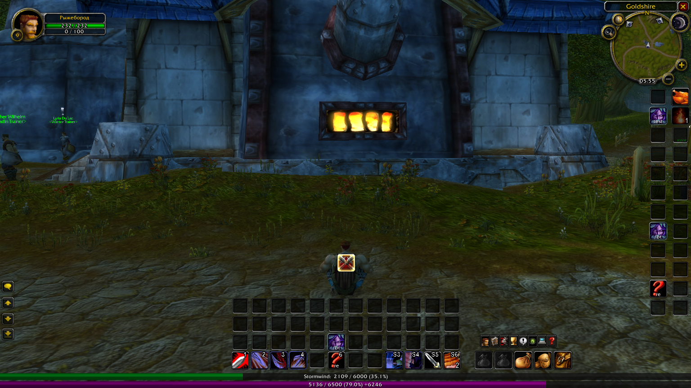

# Bartender4 (Mod)

Простой и усовершенствованный аддон панелей команд для World of Warcraft: The Burning Crusade.



## Установка

### Способ 1: Скачать из релиза (рекомендуется)

1. Перейдите на страницу [Releases](https://github.com/fey/bartender4-mod/releases)
2. Скачайте последний архив (например, `Bartender4-mod-x.x.zip`)
3. Распакуйте архив в папку `Interface\AddOns` вашего клиента WoW
4. Перезагрузите интерфейс игры (`/reload`)

### Способ 2: Клонировать репозиторий

```bash
cd "Interface\AddOns"
git clone https://github.com/fey/bartender4-mod.git Bartender4
```

## Использование

Открыть настройки аддона: `/bt4`, `/bt` или `/bar`

## Авторы

- **Nevcairiel** - оригинальный автор
- **feycot** - модификация и поддержка

## Ссылки

- Репозиторий: https://github.com/fey/bartender4-mod
- Оригинал: https://www.wowace.com/projects/bartender4

## Версия

4.0
